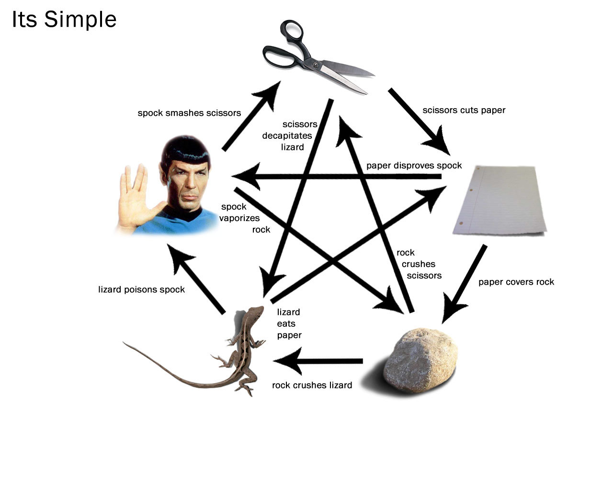

# [My CodeSkulptor script URL](https://py3.codeskulptor.org/#user302_yp8Me5Sa6l_2.py)

[Homework01](https://github.com/20awesome/VladBolibruk_MA2018Python/issues/2)



* [codeskulptor URL for template](http://www.codeskulptor.org/#examples-rpsls_template.py)
* [CodeSkulptor3](https://py3.codeskulptor.org/)
* [Rock paper scissors](https://en.wikipedia.org/wiki/Rock%E2%80%93paper%E2%80%93scissors)
* [Additional weapons](https://en.wikipedia.org/wiki/Rock%E2%80%93paper%E2%80%93scissors#Additional_weapons)
* [Repl.it gives you an instant IDE to learn, build, collaborate, and host all in one place](https://repl.it/languages)


## Function **rpsls(player_choice)** output

```
Player choise is: rock
Computer's choice is: Spock
Computer wins!
```

```
Player choise is: Spock
Computer's choice is: scissors
Player wins!
```

```
Player choise is: paper
Computer's choice is: scissors
Computer wins!
```

```
Player choise is: lizard
Computer's choice is: rock
Computer wins!
```

```
Player choise is: scissors
Computer's choice is: scissors
Player and computer tie!
```