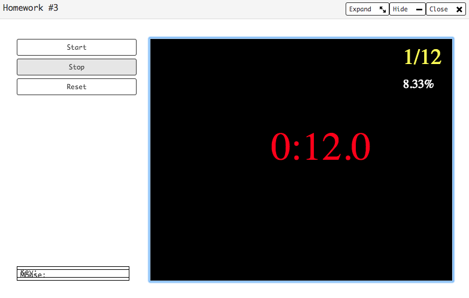
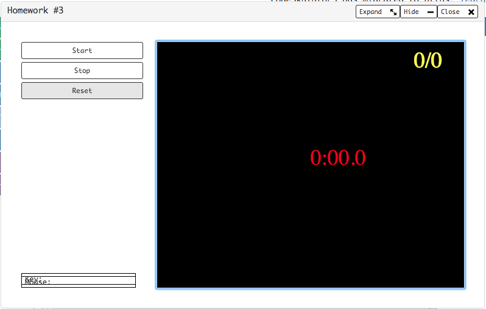

# [Homework 03](https://github.com/20awesome/VladBolibruk_MA2018Python/issues/4)
* [My "Stop: Game"](https://py3.codeskulptor.org/#user302_xcV1AoiZj2w2Tfc_24.py)
* [Testing my 'format' function](https://py3.codeskulptor.org/#user302_nZ8mf921mU_3.py)

----

----

